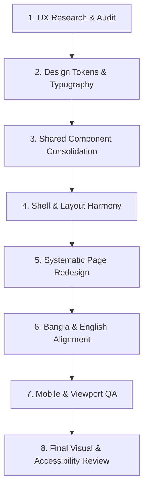

# UI/UX & Design System Master Skill

## 1. Architectural Philosophy & Principles

1. **Restrained, Professional Visual Language**:
   - Zero gratuitous gradients, harsh neon tones, or decorative clutter.
   - Clean, high-trust commerce interface prioritizing content, typography, whitespace, and clear imagery.
   - Minimal borders (`border-border`) and subtle shadows (`shadow-sm` or `shadow-none`), avoiding "nested card within card" disease.

2. **Mobile-First & Touch Ergonomics**:
   - Primary user interaction in rural/suburban Bangladesh occurs on mobile devices (320px to 414px width).
   - Touch targets must be minimum 44x44px.
   - Actionable CTAs (checkout, save, apply, accept delivery) should be placed in thumb-accessible sticky bars or above-the-fold surfaces.
   - Never allow unconstrained horizontal table overflow on mobile; provide swipeable cards, key-value rows, or responsive data views.

3. **Bilingual Typography & Metrics Harmony**:
   - Every text surface must render with equivalent optical weight and visual balance in both English and Bangla.
   - Bangla script has taller ascenders, lower descenders, and complex conjuncts (যুক্তাক্ষর). Default English line-heights cause glyph clipping or suffocated text.
   - Minimum line-height for Bangla body text is `1.6` to `1.75` (e.g. `leading-relaxed` or `leading-loose` on smaller text).
   - Ensure proper font-display swapping and zero layout shift (`font-sans` with Bangla fallbacks like `Hind Siliguri`, `Noto Sans Bengali`).

4. **Bi-Directional Layout (RTL & LTR)**:
   - Use logical CSS properties: `ms-` / `me-` (`margin-inline-start/end`), `ps-` / `pe-` (`padding-inline-start/end`), `start-` / `end-` (`inset-inline-start/end`), `text-start` / `text-end`.
   - Never use hardcoded `left-` / `right-` or `ml-` / `mr-` for directional spacing.
   - Directional icons (arrows, chevrons, navigation indicators) must flip dynamically in RTL mode (`rtl:rotate-180`).

---

## 2. Standard UX Workflow

Whenever undertaking a UI/UX audit or feature redesign, follow this 8-phase protocol:

### Phase 1: UX Audit & Inventory
- Document all user friction points, cognitive overload, inconsistent colors/shadows/spacings, and duplicate components.
- Inspect state representation: every data surface must handle **Loading (Skeleton)**, **Empty (with actionable CTA)**, and **Error (with clear message & retry)**.

### Phase 2: Design System & Tokens
- Enforce strict semantic tokens (`background`, `foreground`, `card`, `primary`, `secondary`, `muted`, `accent`, `destructive`, `border`, `input`, `ring`).
- Prohibit arbitrary hardcoded hex codes (`#1f2937`, `#3b82f6`) in component JSX.
- Define a strict type scale:
  * Display: 32px–40px, bold / extra-bold
  * H1: 24px–30px, bold
  * H2: 20px–24px, semibold
  * H3: 16px–18px, semibold
  * Body: 14px–15px, normal / medium
  * Caption / Small: 12px–13px, normal / muted
  * Price / Numerical: Tabular numbers (`tabular-nums font-semibold`)

### Phase 3: Shared Component Library
- Ensure foundational primitives exist and are consistently reused across all portals (Public, Customer, Seller, Rider, Admin, Super Admin):
  * `ProductCard`: Uniform image aspect ratio (1:1 or 4:3), clean pricing, badge placement, touch targets.
  * `StatusBadge`: Semantic tones (success, warning, info, destructive, neutral) with verified contrast.
  * `EmptyState`: Contextual illustration or icon, empathetic copy in EN & BN, primary action button.
  * `ErrorState`: Friendly explanation, retry handler, navigation fallback.
  * `PageHeader`: Breadcrumb hierarchy, title, description, and contextual action buttons.
  * `DataTable` / `DataList`: Responsive columns, pagination, quick search, status filtering.

### Phase 4: Application Shells & Layouts
- **Navigation Clarity**: The user must always know *Where am I?* and *What can I do here?*.
- **Sidebar Rules**:
  * Highlight active route clearly using subtle background tint (`bg-primary/10 text-primary font-medium`).
  * Never place a duplicate logout button inside sidebar when already present in the global header.
  * Keep top-level items scannable; avoid deep multi-level nested accordions.
- **Header & Mobile Nav**:
  * Compact search bar, language toggle (`EN` / `বাং`), notification bell, user avatar menu.
  * Mobile bottom navigation bar for high-frequency workflows (Customer: Home, Browse, Cart, Orders, Account; Rider: Tasks, Navigation, Earnings, Profile).

### Phase 5: Systematic Page Implementation
- Apply the unified tokens, shared components, and layout patterns across all portal pages without leaving orphaned or non-standard screens.

### Phase 6: Bilingual & RTL/LTR Verification
- Switch between English and Bangla on every screen.
- Verify that translations do not cause text truncation, button overflow, or double-wrapping.
- Verify RTL alignment: labels, inputs, icons, dialog dismiss buttons, and breadcrumbs.

### Phase 7: Responsive Stress Testing
- Test at 320px (iPhone SE / budget Android), 375px (iPhone standard), 768px (Tablet), 1024px (Laptop), and 1440px (Desktop).
- Confirm zero horizontal layout shift or accidental body scroll (`overflow-x: hidden`).

### Phase 8: Accessibility & Interaction Polish
- Verify keyboard focus visible rings (`focus-visible:ring-2 focus-visible:ring-ring`).
- Screen reader labels for icon-only buttons (`aria-label`).
- Semantic HTML tags (`<header>`, `<main>`, `<nav>`, `<section>`, `<article>`).
