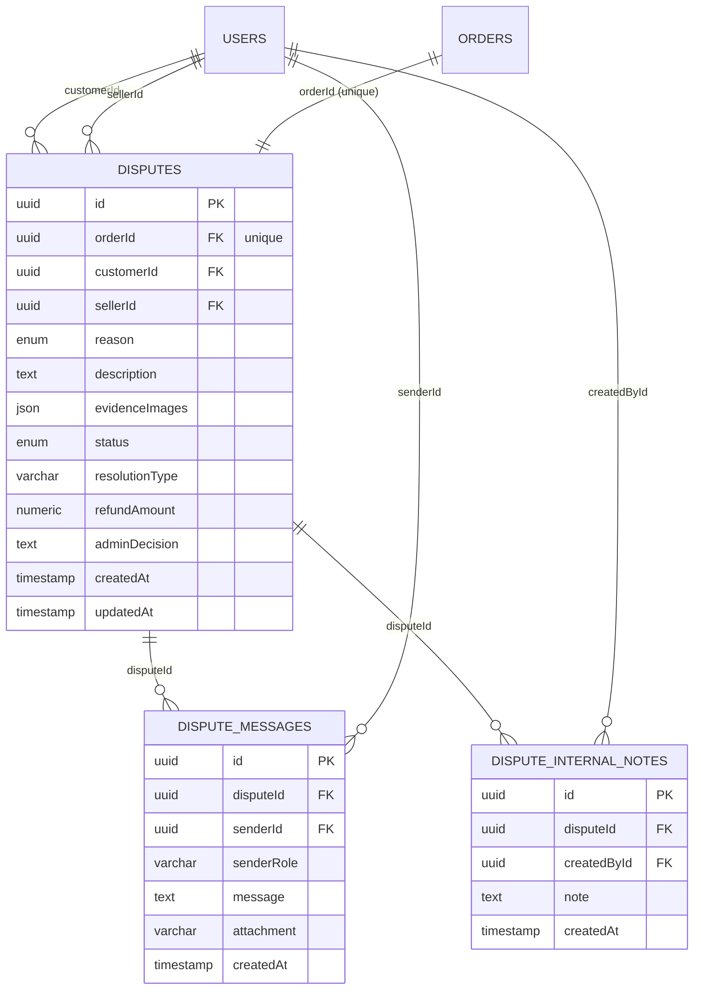

# Dispute Database Architecture

This document describes the relational schema, tables, and constraints powering the Disputes system.

---

## 1. Schema Diagram

---

## 2. Enums

### `DisputeStatus`
- `OPEN` — Dispute submitted by customer, awaiting initial review or seller response.
- `UNDER_REVIEW` — Actively being reviewed or conversation is ongoing.
- `RESOLVED` — Admin made a final decision (refund, replacement, or settlement).
- `REJECTED` — Admin determined dispute is invalid or unsubstantiated.

### `DisputeReason`
- `DAMAGED`
- `MISSING_ITEM`
- `NOT_AS_DESCRIBED`
- `WRONG_ITEM`
- `QUALITY_ISSUE`
- `ITEM_NOT_RECEIVED`
- `QUANTITY_ISSUE`
- `PAYMENT_ISSUE`
- `OTHER`

### `DisputeResolutionType`
- `FULL_REFUND`
- `PARTIAL_REFUND`
- `REPLACEMENT`
- `NO_REFUND`
- `REJECTED`
