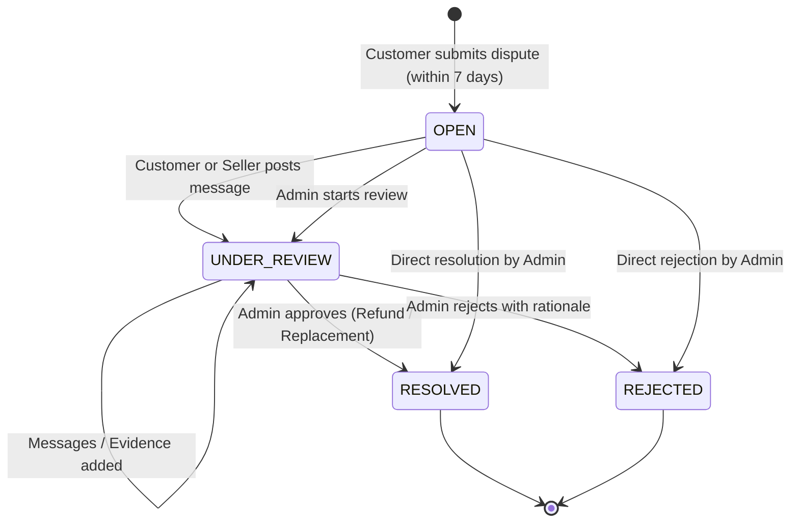

# Dispute Lifecycle & Real-Time Event Flow

This document details the complete state machine, transition rules, and real-time socket events for the Gramer Bazar Dispute Resolution system.

---

## 1. Dispute State Machine



### Transition Matrix

| Current State | Target State | Trigger / Actor | Side Effects |
| :--- | :--- | :--- | :--- |
| **None** | `OPEN` | Customer submits dispute | Order verified (Delivered, <= 7 days). Seller notified. `dispute.created` emitted. Audit log saved. |
| `OPEN` | `UNDER_REVIEW` | Message sent by Seller/Customer | Status transitioned. `dispute.message.created` and `dispute.status.updated` emitted. |
| `UNDER_REVIEW` | `RESOLVED` | Super Admin resolves | Financial engine debits seller & credits customer (if refund). Notifications sent. `dispute.status.updated` emitted. Audit log saved. |
| `UNDER_REVIEW` | `REJECTED` | Super Admin rejects | Admin rationale recorded. Notifications sent. `dispute.status.updated` emitted. Audit log saved. |

---

## 2. Real-Time WebSocket Architecture

Disputes emit WebSocket events through `ChatGateway` via `EventEmitter2`:

```text
DisputesService
     │
     ├── emit('dispute.created')
     ├── emit('dispute.message.created')
     └── emit('dispute.status.updated')
           │
           ▼
      ChatGateway (@OnEvent)
           │
     ┌─────┴─────────────────────────┐
     ▼                               ▼
admin_room                   user_{userId} (Customer & Seller)
  - dispute:created            - dispute:created
  - dispute:message            - dispute:message
  - dispute:updated            - dispute:updated
```

### Frontend Real-Time Listener (`useDisputeRealtimeSync`)

The hook runs globally inside `SocketListeners`:
1. Receives incoming `dispute:created`, `dispute:message`, or `dispute:updated` events.
2. Applies a 3-second sliding window deduplicator to prevent duplicate handling.
3. Selectively invalidates RTK Query cache tags:
   - Specific dispute cache: `{ type: 'Dispute', id: disputeId }`
   - Overall dispute list cache: `'Dispute'`
4. Instantly reflects the latest messages and statuses across open tabs without full page reloads.
