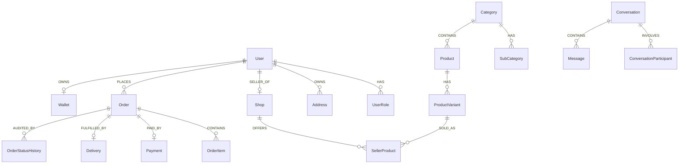

# Database Overview & Entity Schema

## Database Engine
- **RDBMS**: PostgreSQL 15+
- **ORM**: TypeORM 0.3
- **Naming Convention**: `snake_case` database table and column names; `camelCase` TypeScript properties.

---

## Entity Relationship Overview

---

## Key Core Entities & Primary Keys

1. `users` (`id: uuid`): Stores user credentials, phone, email, name, avatar, and hashed refresh token.
2. `roles` (`id: uuid`): System roles (`SUPER_ADMIN`, `ADMIN`, `SELLER`, `RIDER`, `CUSTOMER`).
3. `shops` (`id: uuid`): Vendor shop profile, location, banner, status.
4. `categories` (`id: uuid`): Multilingual marketplace categories (`nameEn`, `nameBn`, `slug`).
5. `products` (`id: uuid`): Master catalog products.
6. `seller_products` (`id: uuid`): Seller pricing, stock quantity, discount price, active status.
7. `orders` (`id: uuid`): Customer orders, address snapshot, subtotal, delivery fee, payment status, order status.
8. `deliveries` (`id: uuid`): Delivery assignment link between `Order` and `Rider`.
9. `wallets` (`id: uuid`): Balance, pending balance, currency.
10. `conversations` & `messages`: Realtime chat threads.
