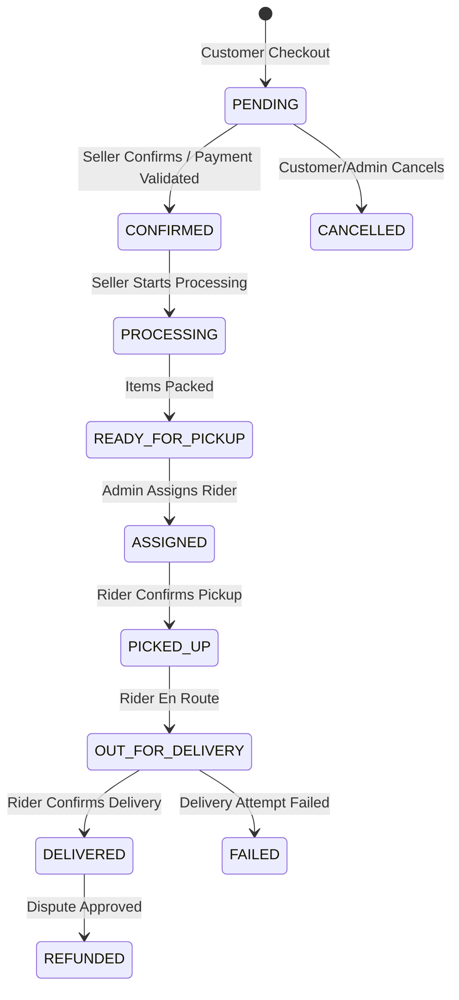

# Order Lifecycle & State Transitions

## Order Status Flow Diagram

---

## Allowed State Transitions & Permissions

| Transition | Authorized Roles | Side Effects & Notifications |
| ---------- | ---------------- | ---------------------------- |
| `PENDING` -> `CONFIRMED` | Seller, Admin, System (Payment Success) | Stocks locked; notification sent to customer and seller. |
| `PENDING` -> `CANCELLED` | Customer, Admin | Inventory stock restored; payment refund initiated if digital. |
| `CONFIRMED` -> `PROCESSING` | Seller, Admin | Notification sent to customer (`order.status.updated`). |
| `PROCESSING` -> `READY_FOR_PICKUP` | Seller, Admin | Notification sent to admin for rider assignment. |
| `READY_FOR_PICKUP` -> `ASSIGNED` | Admin, Super Admin | Delivery record created; notification sent to rider. |
| `ASSIGNED` -> `PICKED_UP` | Rider, Admin | Delivery timeline updated. |
| `PICKED_UP` -> `OUT_FOR_DELIVERY` | Rider, Admin | Customer notified rider is en route. |
| `OUT_FOR_DELIVERY` -> `DELIVERED` | Rider, Admin | Payment status set to `PAID` (if COD); seller earnings credited. |
| `DELIVERED` -> `REFUNDED` | Admin, Super Admin | Customer wallet credited; seller ledger adjusted. |

---

## Data Consistency Checks

1. **Stock Deduction**: Deducted at checkout inside a database transaction (`inventory.quantity -= qty`).
2. **Order History**: Every transition writes an `OrderStatusHistory` audit record.
3. **Realtime Broadcast**: Triggers `order.status.updated` WebSocket event on room `order_{id}` and role rooms.
