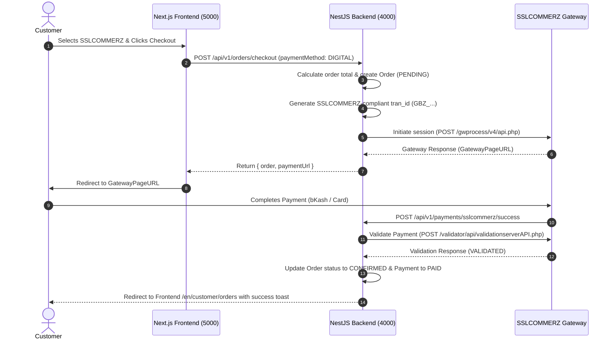

# Payment System Architecture & Gateway Integration

## Overview

Gramer Bazar supports two main payment mechanisms:
1. **Cash on Delivery (COD)**: Payment is collected physically by the delivery rider upon delivery.
2. **Digital Payments (SSLCOMMERZ)**: Payment via SSLCOMMERZ gateway (bKash, Nagad, Rocket, Cards, NetBanking) in Sandbox or Live environment.

---

## SSLCOMMERZ Payment Flow Diagram

---

## Security Invariants

- **Server-side Calculation**: Payment totals are ALWAYS computed from database product records (`seller_products.price`, `discountPrice`, delivery fee rules). Frontend-submitted totals are ignored.
- **Transaction ID Format**: Generated as `GBZ_<orderPrefix8>_<timeBase36>_<rand4>` (max 30 characters) to strictly satisfy SSLCOMMERZ specification.
- **IPN Callback Validation**: Every IPN callback triggers a secondary server-to-server validation check against SSLCOMMERZ validation API endpoint.
- **Replay Protection**: Duplicate callback requests check if payment transaction status is already `PAID` before processing.
