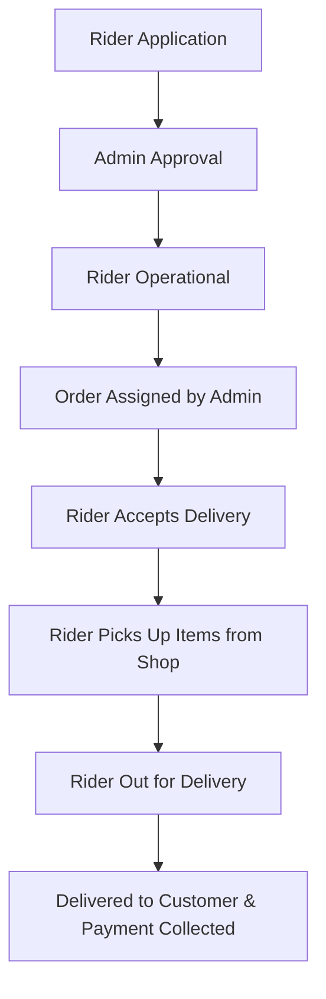

# Rider Logistics & Delivery Workflow

## Onboarding & Delivery Lifecycle

### 1. Onboarding (`/[lang]/become-a-rider`)
- Candidate submits vehicle details, driving license, NID, and operating union/upazila location.
- Admin reviews and approves applicant, assigning the `RIDER` role.

### 2. Operational Fleet Management (`/[lang]/rider`)
- Rider manages availability status (Online / Offline).
- Views active assignments on delivery dashboard (`/[lang]/rider/deliveries`).

### 3. Delivery Progression Step-by-step
- **`ASSIGNED`**: Admin assigns an order ready for pickup. Rider receives push / socket notification.
- **`ACCEPTED`**: Rider accepts the delivery task.
- **`PICKED_UP`**: Rider arrives at seller's shop and confirms item collection.
- **`OUT_FOR_DELIVERY`**: Rider is en route to customer's delivery address. Customer receives notification.
- **`DELIVERED`**: Rider confirms package handoff. If COD order, rider collects cash. Payment status updated to `PAID`.

### 4. Communication (`/[lang]/rider/messages`)
- Direct realtime chat with customer or seller during active delivery.
