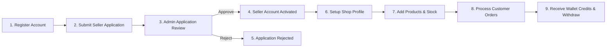

# Seller Workflow Documentation

## Onboarding & Lifecycle

### 1. Application Submission (`/[lang]/become-a-seller`)
- Applicant provides shop name, NID number, trade license, business address, and contact details.
- Status set to `PENDING`.

### 2. Admin Review (`/[lang]/admin/users-management`)
- Admin reviews application details.
- On approval: User role upgraded to `SELLER`, `Shop` entity created, notification sent to applicant.

### 3. Shop Setup & Management (`/[lang]/seller/shop`)
- Seller updates shop banner, logo, business hours, phone number, and address.

### 4. Inventory Management (`/[lang]/seller/products`)
- Seller manages `SellerProduct` catalog.
- Sets selling price, discount price, stock quantity, and active/inactive status.

### 5. Order Fulfillment (`/[lang]/seller/orders`)
- Receives notification of new order (`PENDING` -> `CONFIRMED`).
- Seller updates status to `PROCESSING` and then `READY_FOR_PICKUP`.

### 6. Wallet & Earnings (`/[lang]/seller/wallet`)
- Upon order delivery completion, order total minus platform commission is credited to seller's wallet.
- Seller submits withdrawal payout requests to bank or mobile banking account.
