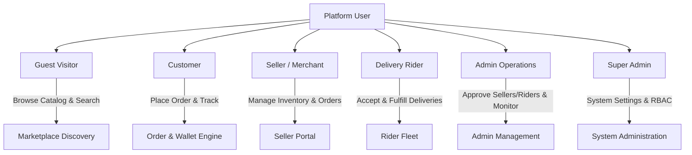

# Gramer Bazar System Overview

## Introduction

**Gramer Bazar** is a multi-vendor, multi-role rural hyper-marketplace and delivery SaaS application tailored for local communities in Bangladesh. It connects local rural producers, farmers, grocery artisans, and retail merchants ("Sellers") with local consumers ("Customers"), facilitated by a localized delivery logistics network ("Riders") and managed by operational administrators ("Admins" and "Super Admins").

## Key Objectives

- **Hyper-local Commerce**: Empower small-scale sellers and rural producers to reach surrounding regional customers.
- **Multilingual Experience**: Native support for English (`en`) and Bangla (`bn`) across all public surfaces and role dashboards.
- **Realtime Fulfillment & Operations**: Realtime order progression, Socket.IO live notifications, and direct customer-seller-rider chat.
- **Financial Transparency**: Integrated digital payment options (SSLCOMMERZ Sandbox/Live) alongside Cash-on-Delivery (COD), automated seller commission tracking, and wallet payout request workflows.

## User Roles & Capabilities

### 1. Guest Visitor
- Browses public marketplace, hero banners, flash sales, featured products, categories, subcategories, and shop profiles.
- Performs product searches with keyword, price range, category, and brand filtering.
- Views detailed product pages with stock status, pricing, discounts, and customer reviews.
- Initiates registration or login flow.

### 2. Customer
- Manages personal profile, delivery addresses, and product wishlists.
- Adds products to cart, applies coupons, selects shipping addresses, and completes checkout via COD or SSLCOMMERZ gateway.
- Tracks active orders with realtime status timeline updates.
- Communicates directly with sellers, riders, or platform support using the integrated chat widget.
- Views personal wallet balance for refunds or promotional credits.
- Submits seller or rider applications to upgrade account capabilities.

### 3. Seller
- Sets up and customizes shop details (name, banner, logo, location, description).
- Manages product catalog, variant prices, stock levels, and active status.
- Processes incoming customer orders through status transitions: `CONFIRMED` -> `PROCESSING` -> `READY_FOR_PICKUP`.
- Tracks shop earnings, commission deductions, and submits payout requests to bank or mobile banking accounts.

### 4. Rider
- Manages online/offline delivery availability status.
- Views assigned delivery orders with pickup and dropoff address details.
- Advances delivery status step-by-step: `ACCEPTED` -> `PICKED_UP` -> `OUT_FOR_DELIVERY` -> `DELIVERED`.
- Communicates with customers or sellers during active deliveries.

### 5. Admin
- Monitors high-level platform analytics (total revenue, order counts, active users).
- Manages user accounts, activates/deactivates sellers and riders.
- Reviews and approves/rejects seller and rider onboarding applications.
- Manages marketplace taxonomy (categories, subcategories, brands).
- Oversees order operations and manually assigns orders to available riders.
- Reviews and approves seller wallet payout requests.

### 6. Super Admin
- Configures global system settings, commission percentages, and gateway credentials.
- Manages system roles and granular permissions.
- Accesses security audit logs and financial reconciliation data.
