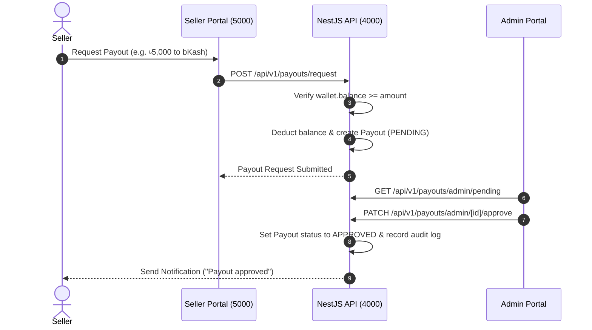

# Wallet & Financial Ledger Architecture

## Overview

The wallet module maintains double-entry transaction ledgers for customers, sellers, riders, and platform revenue.

---

## Entity Definitions

- **Wallet (`Wallet`)**:
  - `userId` / `shopId`: Owner relation.
  - `balance`: Current total balance (decimal).
  - `pendingBalance`: Locked or processing balance.
  - `currency`: Default `BDT` (৳).
- **Wallet Transaction (`WalletTransaction`)**:
  - `walletId`: Target wallet.
  - `amount`: Transaction value (positive for CREDIT, negative for DEBIT).
  - `type`: `CREDIT`, `DEBIT`, `COMMISSION`, `PAYOUT`, `REFUND`.
  - `status`: `PENDING`, `COMPLETED`, `FAILED`.
  - `referenceType` & `referenceId`: Linked Order or Payout ID.

---

## Payout Workflow

---

## Integrity Rules

1. **Transaction Safety**: All wallet balance updates execute inside TypeORM database transactions with row-level locks (`SELECT ... FOR UPDATE`).
2. **Negative Balance Guard**: Debits are rejected if `wallet.balance < requested_amount`.
3. **Auditability**: Every balance change requires an immutable `WalletTransaction` audit entry.
